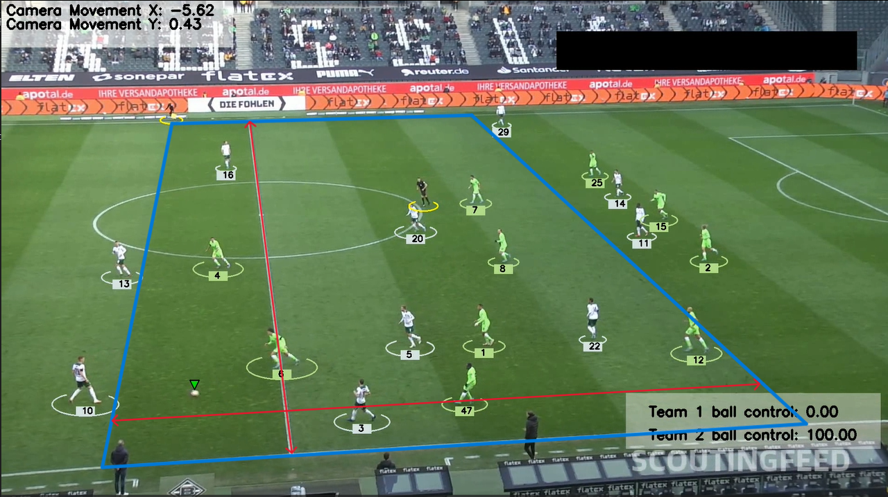

# Football-Analysis-CV

## Introduction
The goal of this project is to detect and track players, referees, and footballs in a video using YOLO. Also training the model to improve its performance. Additionally,Assign players to teams based on the colors of their t-shirts using `Kmeans` for pixel segmentation and clustering. And then can measure a team's ball acquisition percentage in a match.Also useing optical flow to measure camera movement between frames to accurately measure a player's movement. Furthermore Implementing perspective transformation to represent the scene's depth and perspective, allowing to measure a player's movement in meters rather than pixels. Finally Calculate a player's speed and the distance covered.


## Modules Used
The following modules are used in this project:
- `YOLO`: AI object detection model
- `Kmeans`: Pixel segmentation and clustering to detect t-shirt color
- `Optical Flow`: Measure camera movement
- `Perspective Transformation`: Represent scene depth and perspective
- Speed and distance calculation per player



## Installation

### Install the required packages

```bash
$ pip install -r requirements.txt
```
## Trained Models
you can download it from her :
- [`Trained Yolo v5`](https://drive.google.com/file/d/1DC2kCygbBWUKheQ_9cFziCsYVSRw6axK/view?usp=sharing)

  - dawnload `best.pt` model and add it to the `models folder` 

## Example of Input video 
- [`Download from here`](https://drive.google.com/file/d/1t6agoqggZKx6thamUuPAIdN_1zR9v9S_/view)


### Example of Output video 
- [`Download from here`](https://drive.google.com/file/d/1dPV__Vuu4V7_KknjhG8QxQEDne95KPQZ/view?usp=sharing)


